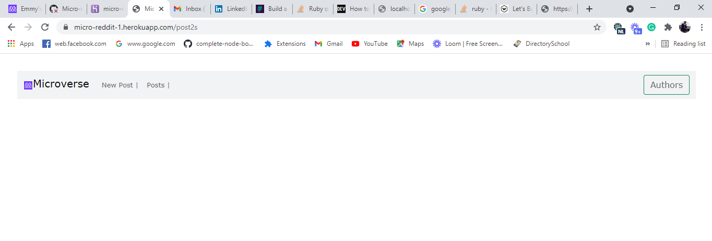
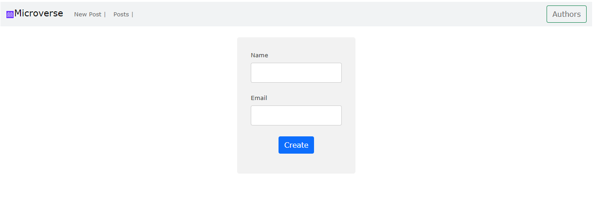
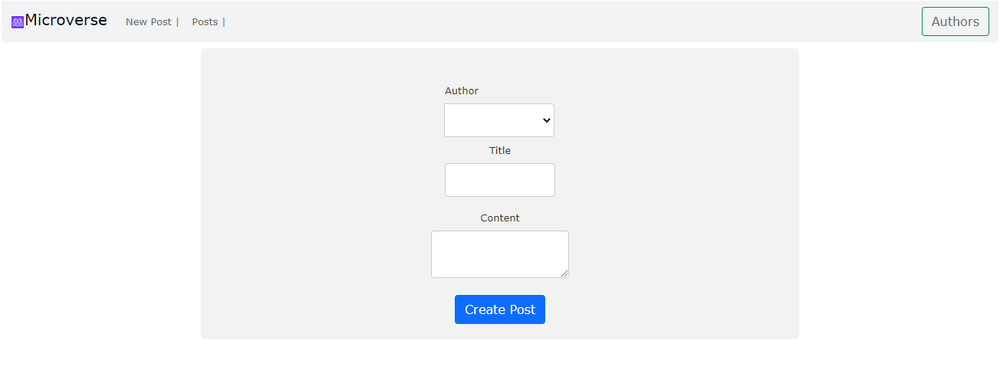
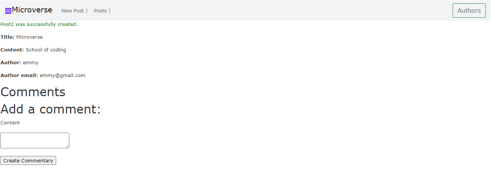
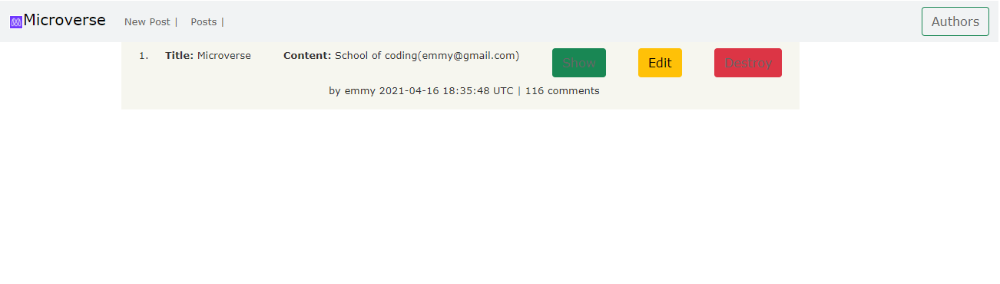

# Blog_App
> This is a Micro-reddit App used to create Author, new post, and comment using Ruby on Rails/Active Record.

**What you can do with this project**
- You can create Author name and email
- You can Create new post used after selecting Author name.
- You can edit the created post.
- You can delete the post.
- You can add comment

## Built With

- Ruby 2.7.2 and 3.0.0
- Ruby on Rails 6.1.1
- VS code
- Linters (RuboCop)

## Live Server Link
[Live demo link](https://micro-reddit-1.herokuapp.com/)

## Prerequisites
Text Editor (VSCode is suggested.) Ruby Rails Bundler Yarn SQL

## Getting Started

To get a local copy up and running follow these simple example steps.

- On the project GitHub page, navigate to the main page of the repository [this page](https://github.com/kiranitor123/blog_app.git).
- Under the repository name, locate and click on a green button named `Code`.
- Copy the project URL as displayed.
- If you're running Windows Operating System, open your command prompt. On Linux, Open your terminal.
- Change the current working directory to the location where you want the cloned directory to be made. Leave as it is if the current location is where you want the project to be.
- Type `git clone`, and then paste the URL you copied in Step 3. 
  `$ git clone https://github.com/kiranitor123/blog_app.git` <em>Press Enter key</em> 
- Press Enter. Your local copy will be created.

Please Note that you must have Git installed on your PC, this can be done [here](https://gist.github.com/derhuerst/1b15ff4652a867391f03).

## How to use the forms?

1. Follow Getting Started section to download the game
2. Open/navigate to the project directory in your terminal
3. Run `bundle install`
4. Migrate, run `rails db:migrate`
5. bin/rails server

## Authors

👤 **NSABIMANA Emmanuel**

- GitHub: [@emmyn5600](https://github.com/Emmyn5600)
- Twitter: [@NSABIMA62253884](https://twitter.com/NSABIMA62253884)
- LinkedIn: [@nsabimana-emmanuel-4276091b2](https://www.linkedin.com/in/nsabimana-emmanuel-4276091b2/)

👤 **Rolando**

- GitHub: [@RolandoAlvarezFaye](https://github.com/kiranitor123)
- Twitter: [@RolandoAlvarezFaye](https://twitter.com/FayeRolando)
- LinkedIn: [Rolando](https://www.linkedin.com/in/rolando-diego-alvarez-faye-b2b34a1a9/)

## 🤝 Contributing

Contributions, issues, and feature requests are welcome!

Feel free to check the [issues page](https://github.com/kiranitor123/blog_app/issues).

## Show your support

Give a ⭐️ if you like this project!

## Acknowledgments

- Microverse

## 📝 License

This project is [MIT](https://en.wikipedia.org/wiki/MIT_License) licensed.